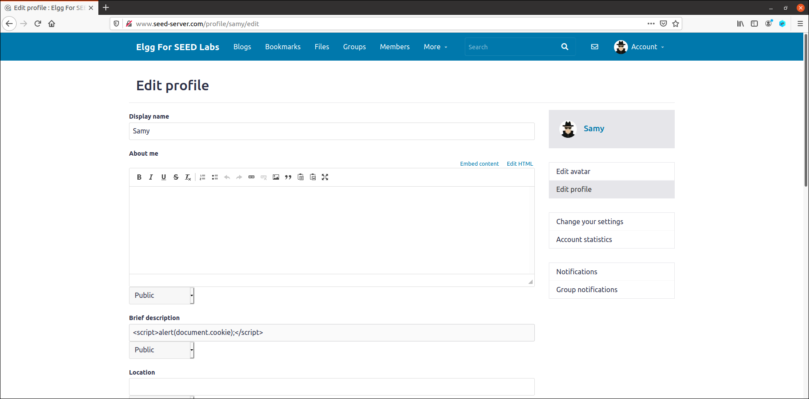

# Setup
We start this lab by following the instructions in the guide:

Add the lines to the /etc/hosts file (actually, we only need to add 10.9.0.5 www.seed-server.com, as the rest are already there);
Setup the docker containers using the alias dcbuild and launch them using dcup.

# Lab Tasks

## 3.1 Preparation: Getting Familiar with the "HTTP Header Live" tool

In this preparatoty task we just follow the instructions given in the Guidelines section 5.1.

## 3.2 Posting a malicious message to display an alert window

For this task, we chose to use the Samy profile. By pasting the suggested javascript code in the "brief description" field, as input is not sanitized, everytime any other user visits the profile, an alert pop-up will be displayed with the message "XSS". With this we can start to play around with the XSS attack and understand its foundations.

Using the folloowing code in Samy's brief description field:

  

When acessing Samy's profile while logged in as Alice:

  

## 3.3 Posting a malicious message to display cookies

By changing the argument of the alert window that we created with the javascript of the last task, we can display important information about the site, user, session, etc. In this case, we change the messagae 'XSS' to __document.cookie__, which will result in the display of the cookies of the document in the pop-up alert.
However, only the user viewing the malicious profile will be prompted with this message.

Using the folloowing code in Samy's brief description field:

  

When acessing Samy's profile while logged in as Alice:

  

## 3.4  Stealing cookies from the victim's machine

In this task, we go a step further and make the cookies be sent to the attacker, instead of only being displayed to the user.  To achieve this, the malicious JavaScript code needs to send an HTTP request to the attacker, with the cookies appended to the request.

Using the folloowing code in Samy's brief description field:

  

Using the netcat command with the recommended options, we can listen for any requests made from users that visited our profile:

When we access Samy's profile while logged in as Alice, for example, we can see that the cookies are sent to us via the request:

  

## 3.5  Becoming the victim's friend

In this task, our objective is to write a worm that adds Samy as a friend of any user that visits the malicious profile.

Our malicious javascript file must forge an HTTP request, so the first step is to add Samy as a user normally, and analyze the request that is sent, so we can later replicate it. To do this, we use the extension HTTP Header Live.

  

The full request URLis: 
```
http://www.seed-server.com/action/friends/add?friend=59&__elgg_ts=1669477299&__elgg_token=N1grzJfcHfWAhbkLgzsmjw&__elgg_ts=1669477299&__elgg_token=N1grzJfcHfWAhbkLgzsmjw
````

Using this information, we can now write our worm in the file __friend_worm.js__:

```javascript
<script type="text/javascript">
window.onload = function () {
    var Ajax=null;
    var ts="&__elgg_ts="+elgg.security.token.__elgg_ts;
    var token="&__elgg_token="+elgg.security.token.__elgg_token;
    
    //Construct the HTTP request to add Samy as a friend.
    var sendurl="/action/friends/add?friend=59" + ts + token;
    
    //Create and send Ajax request to add friend
    Ajax=new XMLHttpRequest();
    Ajax.open("GET", sendurl, true);
    Ajax.send();
    }
</script>
```

When we place this code in Samy's about me field, and access his profile while logged in as Alice, we can see that Alice is added as a friend of Samy:

  
  
  
  

__Questions:__

1. The numbered lines are used to authenticate the user when the request is made. The security tokens are unique to each user and are used to prevent other users to make requests in their name. Using this, our forged request will be accepted by the server.

2. No, if the application only provided the Editor mode for the "About me" field, an attack would not be successful, as the Editor mode filters and encodes any HTML special characters and tags - input sanitization. This way we are not able to inject our script into the profile page.


# Group 7, 26/11/2022
 
* Afonso Jorge Farroco Martins, up202005900@fe.up.pt
* Eduardo Filipe Leite da Silva, up202005283@fe.up.pt
* José Diogo Pinto, up202003529@fe.up.pt

