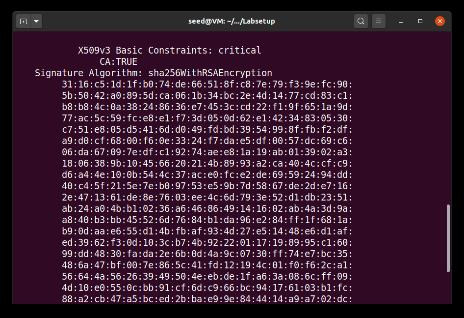
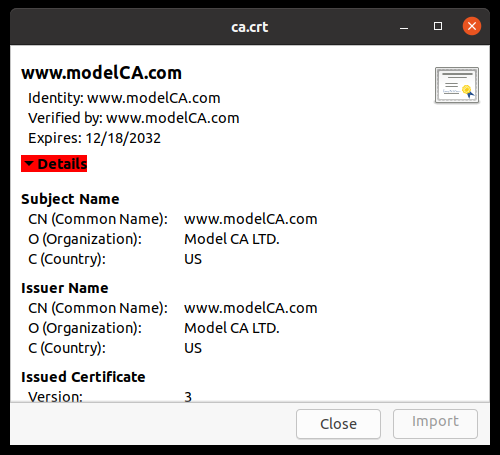
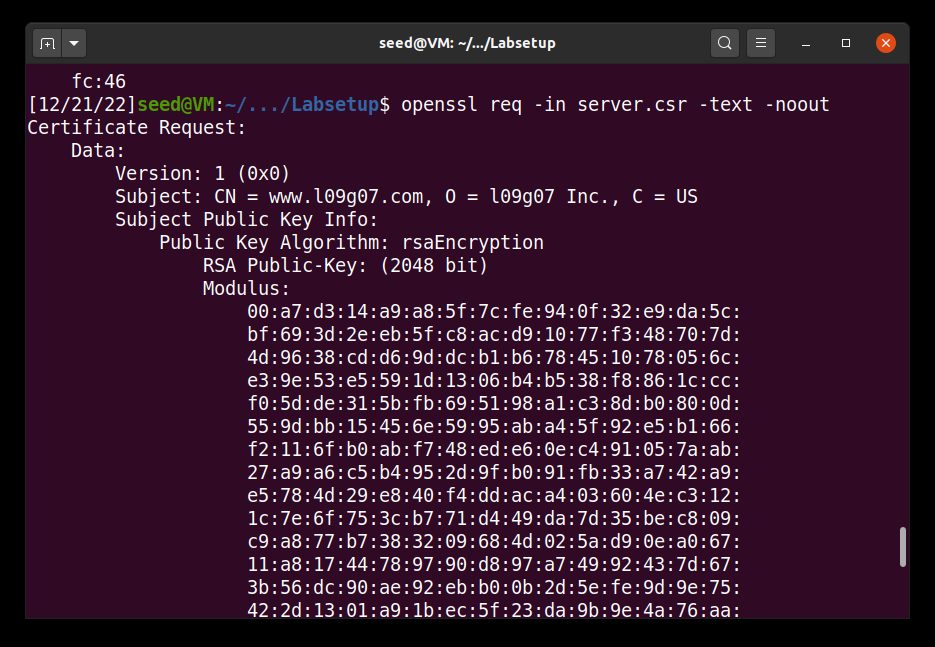
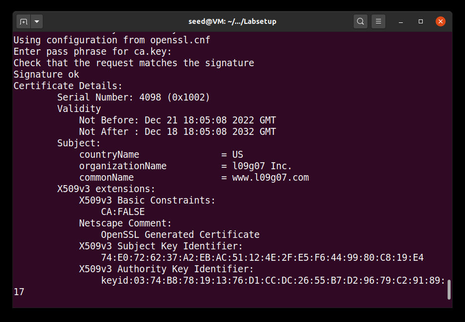
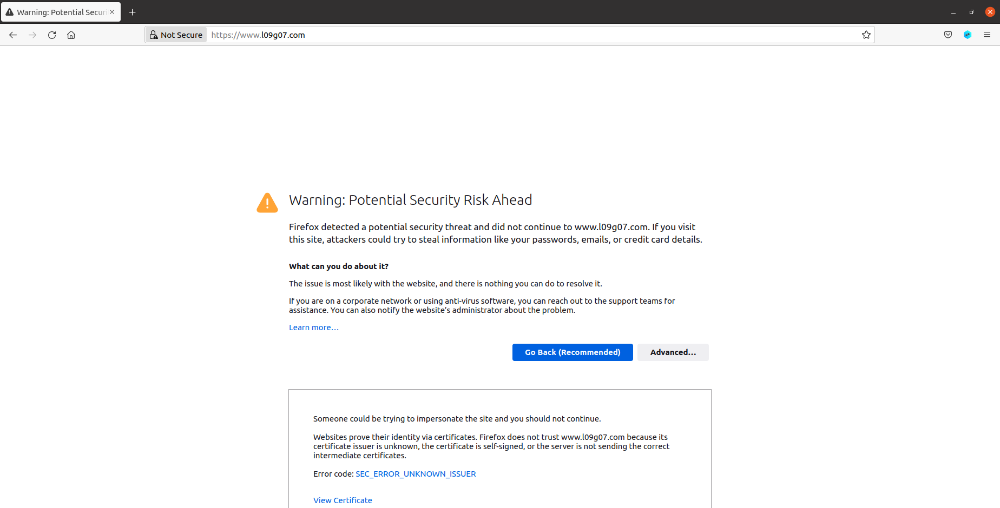
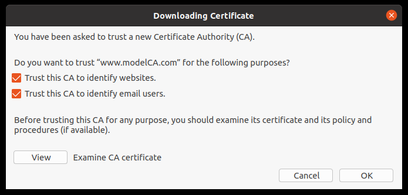
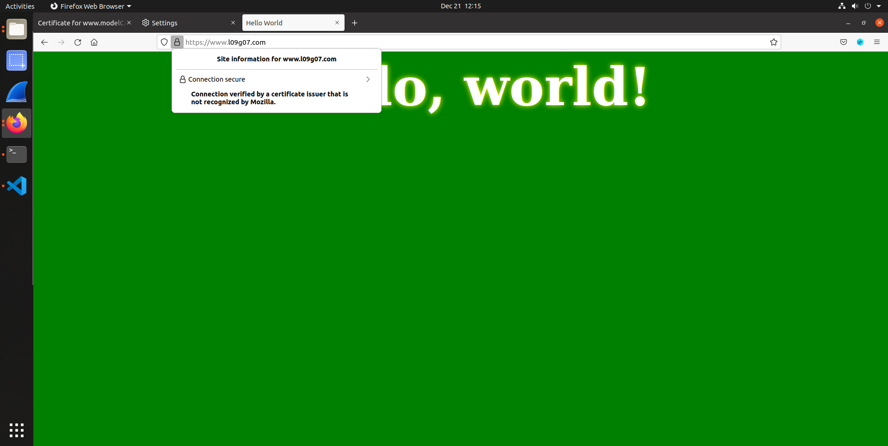
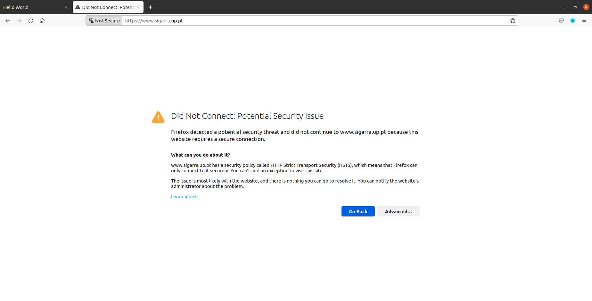
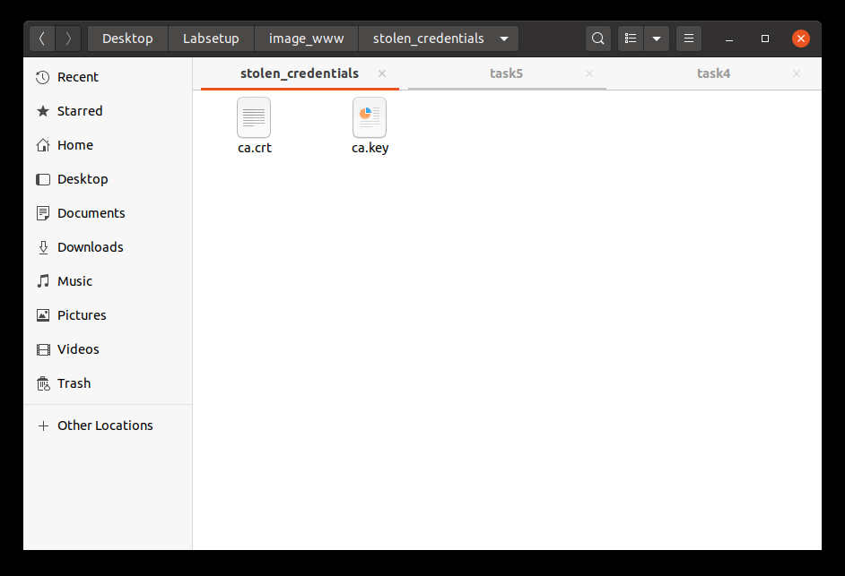
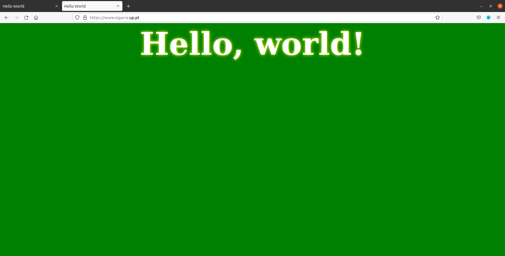

# Setup

We start this lab by following the instructions in the guide for the setup, setting up servers, containers and openssl configurations.

# Lab Tasks

## 3.1 Task 1: Becoming a Certificate Authority (CA)

In this task, we use the command given in order to not be prompted with additional info during the certificate's creation.

```bash
openssl req -x509 -newkey rsa:4096 -sha256 -days 3650 \
-keyout ca.key -out ca.crt \
-subj "/CN=www.modelCA.com/O=Model CA LTD./C=US" \
-passout pass:dees
```

## Questions

## What part of the certificate indicates this is a CA’s certificate?

In the section "basic constraints", the attribute "Certificate Authority" is set to Yes, which indicates that this is a CA's certificate.

  

## What part of the certificate indicates this is a self-signed certificate?

In the details of the certificate, we can see that the issuer and the subject are the same, which indicates that this is a self-signed certificate. Also, the command we ran to generate the certificate included the flag -x509, which is used to create self-signed certificates.

  

In this preparatoty task we just follow the instructions given in the Guidelines section 5.1.

## In the RSA algorithm, we have a public exponent e, a private exponent d, a modulus n, and two secret numbers p and q, such that n = pq. Please identify the values for these elements in your certificate and key files.

__e -> publicExponent:__ 65537 (0x10001)

d -> privateExponent:
    1b:8c:83:88:89:c5:64:13:22:24:bf:18:57:4e:57:
    3c:d7:f6:47:17:97:5c:c5:e0:47:5a:49:cf:d1:91:
    ca:37:2b:b4:cd:79:76:02:35:dd:f1:4f:26:79:27:
    15:36:bd:cd:c4:a5:a1:29:21:15:00:ea:f7:2f:6d:
    34:00:8d:4a:09:4f:04:44:36:43:54:7a:4a:6c:0f:
    02:ce:d4:59:e7:ff:c9:23:e0:9a:24:d8:92:c5:29:
    52:3f:a7:d1:1d:2b:91:db:aa:38:06:69:5a:96:f8:
    94:63:4f:fd:b2:f6:1d:79:b6:ea:b3:cf:e9:47:f7:
    19:08:36:0c:03:ff:93:f7:00:8c:8c:99:8d:8c:1f:
    36:65:bf:09:9c:a7:57:af:f7:ab:c1:54:f8:ec:c0:
    4a:83:ea:2d:00:4c:2e:5c:ad:d1:fe:aa:f0:8c:dd:
    97:04:48:73:08:a4:4f:8a:01:69:b7:2e:e0:7c:3c:
    be:dc:94:47:05:59:8c:73:72:c5:bd:5d:69:66:4c:
    bb:70:a1:a6:07:7e:7a:05:a8:f6:15:6f:54:6a:25:
    71:31:67:b1:fe:53:70:5a:f3:6b:86:d3:8c:41:2c:
    80:9e:61:31:4f:dc:cf:9f:be:84:38:43:cb:2c:fe:
    66:38:8d:a8:e0:b9:77:fc:19:f2:03:0f:37:1d:6b:
    85:df:63:78:de:cd:a5:45:d3:69:5e:ea:a0:2a:ad:
    3d:2d:94:5c:99:9c:6b:00:19:cc:aa:76:38:4c:dc:
    c3:a7:ec:3c:02:82:ea:e4:0a:57:71:16:cc:45:89:
    cf:37:20:5b:0b:32:5e:fb:08:92:b0:de:a3:af:49:
    74:b4:14:32:7b:ce:3b:24:04:01:56:3a:e0:ba:9a:
    aa:2d:98:d8:0c:85:b7:60:0f:9f:b1:8d:12:30:2e:
    fa:d7:b3:63:46:14:3c:55:17:15:31:c4:fa:9f:a0:
    e1:ca:a5:cb:d4:d0:1e:e0:f5:be:8e:64:62:7c:27:
    bc:03:ab:1e:d3:a5:d1:d3:87:7c:f4:13:52:7c:16:
    17:25:29:ad:97:6d:bf:8d:8b:5f:d6:2f:53:ea:22:
    2e:bd:39:ef:d2:80:4e:01:e4:e1:1e:19:46:4d:bf:
    ba:03:ca:62:34:1c:7f:be:de:b2:0a:16:42:08:ff:
    84:24:cb:b6:5e:59:9e:b1:40:6d:f9:8d:0f:c9:94:
    b1:86:20:68:b4:72:cc:5b:fd:b2:95:45:29:81:10:
    14:68:58:82:21:78:d3:01:43:26:79:fc:60:79:1c:
    df:51:51:06:c8:1c:05:fc:53:91:b1:ce:e7:42:44:
    de:f1:9d:b3:6d:07:cb:f7:ab:14:f5:2f:2b:53:0e:
    e4:01

__n -> modulus:__
    00:bc:11:e5:41:35:47:32:25:b6:65:94:66:ff:53:
    29:42:1c:ab:7e:a9:c5:a9:bd:5c:83:44:b9:71:5e:
    c3:4d:09:f8:a3:a8:7c:ad:f6:ee:15:86:52:8d:df:
    ef:51:02:36:bb:cc:76:c4:a9:05:11:f9:2c:29:a9:
    ee:2b:e3:05:67:00:ab:07:56:e4:e4:fa:d1:09:8e:
    54:e0:5e:7b:f7:5e:8d:41:cd:e9:c2:b4:8d:6e:05:
    04:09:a0:44:b6:bf:0e:e8:4c:b2:04:b5:cb:f9:2e:
    97:57:c8:a6:6d:4e:2e:84:b0:54:99:08:63:c3:32:
    5b:55:50:9d:8d:7e:9a:3d:30:55:6d:93:ca:15:7c:
    12:d7:2c:17:73:15:c9:13:65:1a:56:da:79:05:2a:
    7c:5a:90:c3:dd:4a:e9:59:d6:15:b9:81:9f:fa:a9:
    56:4a:4a:39:cb:8c:91:b6:24:4a:c4:11:b8:f3:7f:
    12:a4:83:ec:78:26:6a:49:bb:b6:6e:82:a4:df:ac:
    1c:34:d6:1b:e9:34:2c:69:ec:73:f0:98:e4:1a:47:
    84:24:73:02:a6:8f:81:3e:ad:53:cc:a5:85:a0:fa:
    af:d5:9f:9f:23:71:04:40:c2:ef:e4:72:8f:73:a5:
    cd:4f:f8:d9:a3:5e:c8:56:c3:09:c3:55:5d:b6:18:
    d1:29:42:5e:ba:d5:0b:01:ca:34:d4:28:62:b1:69:
    c0:df:1d:5c:2a:cf:fe:b7:2d:16:50:05:e7:45:ad:
    1d:85:9c:d1:b7:ae:8c:59:cd:e2:35:30:b9:45:01:
    7a:a8:b6:80:b9:7a:ae:cd:9b:7f:77:a7:ba:0e:26:
    26:5f:07:4c:37:ee:67:af:db:00:9a:19:48:ca:62:
    51:37:a8:7e:ce:f3:b9:41:bf:2c:07:c8:a5:18:13:
    a0:1f:c3:d6:f9:7c:1c:3f:e2:21:82:f0:e8:d3:03:
    d6:8d:ba:bd:03:95:59:a6:f1:fe:56:66:6c:55:5e:
    97:a7:0f:9b:01:bf:79:73:1c:4b:92:ae:f2:9b:75:
    cd:d0:0e:5b:42:fb:7c:35:25:a7:11:5b:b1:59:b9:
    44:f5:98:4c:8d:50:7b:6a:1a:24:7a:b7:1d:4b:90:
    92:6f:b9:d6:1a:29:69:8d:87:92:9c:0b:16:58:4f:
    ff:67:ca:93:a3:b4:f4:b6:19:42:8e:5a:dc:1e:be:
    7d:e6:30:7b:df:c0:ef:68:71:8b:42:6f:78:31:8b:
    ed:77:ea:42:fa:cd:ca:46:bd:84:40:38:fa:99:5d:
    23:1b:e2:b1:b9:bf:72:4c:1c:35:2b:4e:58:5d:09:
    c4:87:c7:ea:e3:8a:d9:b5:a1:70:2c:8d:59:6f:50:
    cb:25:67


__p -> prime1:__
    00:e1:de:8c:d6:7c:ce:67:86:4c:32:43:ed:fa:e7:
    2e:dc:da:56:a6:7c:0d:c3:a4:32:b8:49:7e:3c:72:
    0c:9b:31:14:e2:4a:16:49:76:e4:29:aa:cf:ae:a1:
    81:f8:38:02:45:a8:6e:f9:a8:e3:85:fc:f1:71:48:
    03:4f:a2:29:d9:b5:1c:35:02:76:54:a6:6c:e0:77:
    30:fc:b1:00:ea:ed:74:b3:1a:c2:4b:57:a4:e6:72:
    68:bd:53:33:c0:4f:3c:2c:a6:4a:2b:53:61:06:46:
    4c:85:98:34:5b:fb:5c:09:14:d0:a5:1b:fa:cd:66:
    6f:e0:f4:b6:b2:5e:a1:fd:77:ed:73:5e:72:d6:dc:
    88:1a:b6:47:1f:a6:8b:c5:57:26:1b:9f:e2:45:8f:
    93:71:4e:4c:13:5e:a9:e9:02:d4:43:8f:67:f6:0e:
    98:d1:07:aa:3b:c9:3e:23:f4:ef:ad:fd:c8:20:91:
    09:f3:a8:02:d2:07:e9:0f:2c:2b:bd:21:35:bd:68:
    53:e1:4b:da:e4:5a:1b:9d:f1:be:ee:6b:39:1c:22:
    1b:ba:05:71:73:ec:7e:b6:fe:14:d5:66:b1:fd:1e:
    a1:5d:ff:6c:57:fa:54:72:98:4e:1e:c8:d4:78:ad:
    80:ae:c3:f0:58:f7:b2:85:9a:c6:57:91:2c:41:16:
    61:6d

__q -> prime2:__
    00:d5:28:7e:25:a2:92:70:87:b9:d1:bf:36:eb:14:
    5b:e8:ff:d9:c3:4b:ec:eb:06:41:07:90:e7:c8:da:
    d1:a0:c6:ee:59:f0:d6:f5:58:a9:e5:65:91:94:d1:
    c5:70:37:2a:19:5c:48:f0:ff:2c:33:32:52:f2:cf:
    be:c5:14:8b:f2:8b:90:9a:11:9f:a7:b8:cb:03:ae:
    60:e7:74:e8:58:37:37:8f:4b:4d:fd:d0:c3:76:88:
    ba:42:b8:d0:25:d7:30:af:d7:f5:f9:ca:df:f2:97:
    0b:23:df:f1:80:4d:8d:de:1f:4b:9e:3f:b0:bd:4b:
    06:3c:f7:4b:15:83:a1:82:d8:53:6e:58:40:1a:72:
    79:92:57:af:07:7a:98:6f:61:7b:6c:09:84:6d:25:
    5c:31:da:eb:92:de:71:a0:6a:1a:6c:e0:8b:85:df:
    ca:de:72:f8:80:6f:23:fe:1c:5e:79:e3:55:53:3a:
    d0:ec:af:2b:b6:20:14:6d:f3:6b:4f:5b:16:7a:fd:
    cf:08:bc:6c:69:80:cc:6e:a3:5d:73:9e:11:de:e6:
    18:1f:ae:c0:1f:f9:65:32:4e:7f:17:8e:14:07:57:
    74:2a:a9:20:5c:4c:ec:c5:f1:d2:cd:69:51:7e:d8:
    b3:b9:ab:15:0a:c1:c5:ae:d8:79:d4:64:68:8c:72:
    71:a3


## 3.2 Task 2: Generating a Certificate Request for Your Web Server

The objective of this task is to create a "Certificate Signing Request", CSR, generated by the CA that we created in the first task.

Using the following command, we generate a CSR for the web server, also adding the domain's alternative names.

```bash
openssl req -newkey rsa:2048 -sha256 -keyout server.key -out server.csr -subj "/CN=www.l09g07.com/O=l09g07 Inc./C=US" -addext "subjectAltName = DNS:www.l09g07.com, DNS:www.l09g07.net, DNS:www.l09g07.pt" -passout pass:dees
```

Using the following command, we can see that the certificate request was generated successfully:

```bash
openssl req -in server.csr -text -noout
```
  

## 3.3 Task 3: Generating a Certificate for your server

In this task, we will use our own trusted CA to sign the certificate request generated in the previous task. We will use the following command, which makes use of the config file we copied in task 1:

```bash
openssl ca -config openssl.cnf -policy policy_anything -md sha256 -days 3650 -in server.csr -out server.crt -batch -cert ca.crt -keyfile ca.key
```

For security reasons, the default setting in openssl.cnf doesn't allow the openssl ca command to copy the extension field from the request to the final certificate, so we need to enable it with 

```
copy_extensions = copy
```

And we get the following result:

  

## 3.4 Task 4: Deploying Certificate in an Apache-Based HTTPS Website

For this task, we followed the steps depicted below:

1. Use mkdir to create a new directory task4 in the Labsetup folder
2. Copy the dockerfile, the bank32_apache_ssl,cnf file, index and index_red files and the certs folder to this new directory. Copy also ca.crt, server.crt and server.key to the certs folder.
3. Change the dockerfile content:

```bash
FROM handsonsecurity/seed-server:apache-php

ARG WWWDIR=/var/www/l09g07

COPY ./index.html ./index_red.html $WWWDIR/
COPY ./l09g07_apache_ssl.conf /etc/apache2/sites-available
COPY ./certs/server.crt ./certs/server.key /certs/

RUN chmod 400 /certs/server.key \
    && chmod 644 $WWWDIR/index.html \
    && chmod 644 $WWWDIR/index_red.html \
    && a2ensite l09g07_apache_ssl

CMD tail -f /dev/null
```

Change also docker compose to build the container based on the new content - ```build: ./task4```

4. Change the apache config file name to l09g07_apache_ssl.conf and add the following changes:

```bash
<VirtualHost *:443>
    DocumentRoot /var/www/l09g07
    ServerName www.l09g07.com
    ServerAlias www.l09g07.net
    ServerAlias www.l09g07.pt
    DirectoryIndex index.html
    SSLEngine On
    SSLCertificateFile /certs/server.crt
    SSLCertificateKeyFile /certs/server.key
</VirtualHost>

<VirtualHost *:80>
    DocumentRoot /var/www/l09g07
    ServerName www.l09g07.com
    DirectoryIndex index_red.html
</VirtualHost>
```

5. Run dcbuild and dcup, then gain access to the new container's shell using docksh

6. Run ```service apache2 start``` , using the password (dees).

7. On Firefox, access l09g07.com

After this proccess, what happens is that Firefox will prompt us with a warning saying that the connection is not secure, because it only trusts a certain group of certificates. 

  

So, we should tell the browser to trust our CA, which will then allow us to connect safely to the domain. If we go to about:preferences#privacy, on the bottom we can find the certificates section, where we can upload our CA information, so the browser begins to trust our CA.

  

If we try to connect again, we see that Firefox recognises the connection as secure. Besides this, the browser still tells us that the connection is verified by a CA that is not recognized by Mozilla as default.

  

## 3.5 Task 5: Launching a Man-In-The-Middle Attack

In the first step of this task, we will repeat the process used in the previous tasks to generate a new apache configuration and docker container (using a new directory task5). We will setup a new virtual host with server name www.sigarra.up.pt, with which we will try to launch a MITM atttack when a user tries to visit SIGARRA.

In the second step, we simulate a DNS cache poisoning attack by adding 10.9.0.80 www.sigarra.up.pt to the etc/hosts file.

When we try to access the malicious page, even after changing the DNS routing, we are still prompted with a warning by the browser. 

  

This happens because the certificate we are trying to use for the SIGARRA website was created for our domain (l09g07.com) and its aliases, so the browser detects this and marks the page as dangerous, restricting access. With this, we can observe that, nowadays, browsers are evolving to be more and more secure.

## 3.6 Task 6: Launching a Man-In-The-Middle Attack with a Compromised CA

In order to successfully perform a MITM attack, one possible scenario, although highly unlikely, is the private key used by the CA to sign certificates being stolen. As we previosuly trusted in the CA that had the keys stolen, now when we access the malicious SIGARRA page, we might not even notice that we are being attacked via MITM. 

To simulae this, we created a copy of ca.crt and ca.key in a folder named stolen_credentials, and setup the rest as before.

  

The only difference is that this time we change the entity that requests the certificate to www.sigarra.up.pt / FEUP Inc., and signed it with the stolen keys.

```bash
openssl req -newkey rsa:2048 -sha256 -keyout server.key -out server.csr -subj "/CN=www.sigarra.up.pt/O=FEUP Inc./C=US" -passout pass:dees
```

After doing this, the certificate for the malicious page is issued, and after we restart the docker container and apache2 server, if we try to access SIGARRA, we will be prompted with the malicious page, and the browser even identifies the connection as secure, concluding the MITM attack successfully.

  


# Group 7, 23/12/2022
 
* Afonso Jorge Farroco Martins, up202005900@fe.up.pt
* Eduardo Filipe Leite da Silva, up202005283@fe.up.pt
* José Diogo Pinto, up202003529@fe.up.pt
