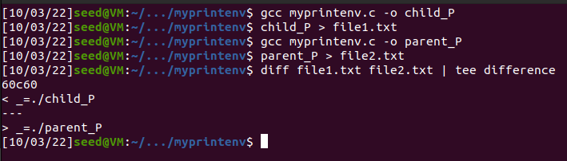
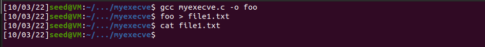
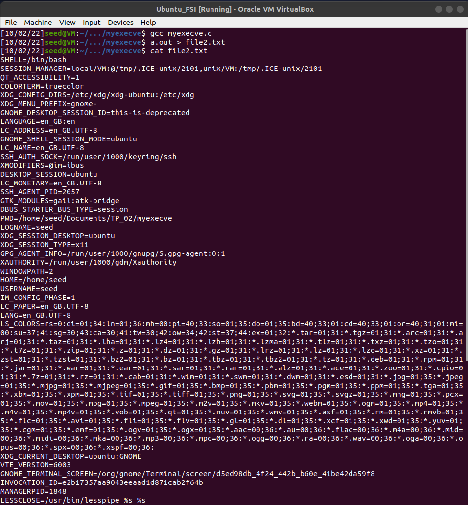
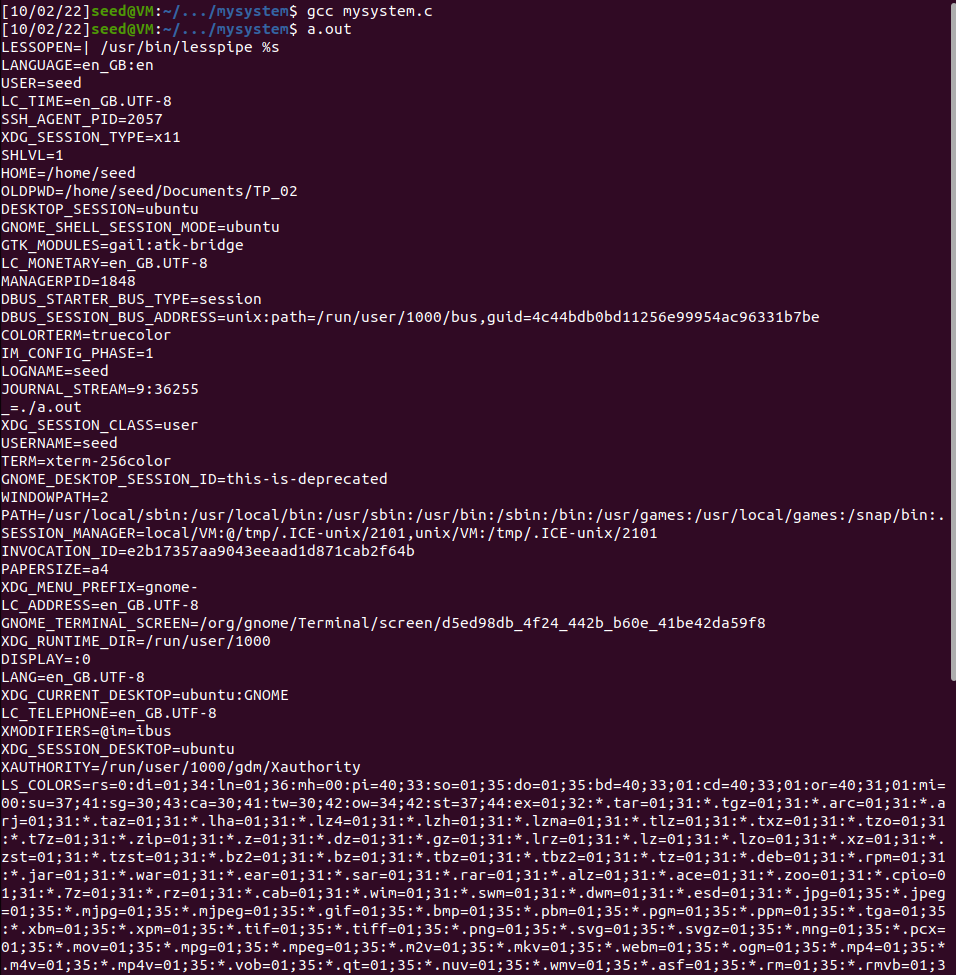
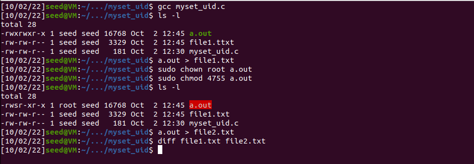
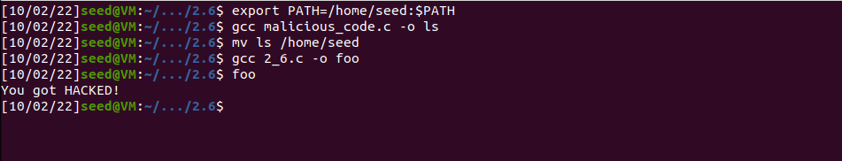

# LOGBOOK - WEEK 4

# 2.1

## SET new environment value
```bash
export MY_VAR=1 && MY_APP=1
```

## CHECK new environment value
```bash
printenv | grep -E "MY_VAR|MYAPP" 
```
-E treats the query string like an regular expression

## UNSET environment value
```bash
unset "MYAPP"
```

# 2.2

In this section, seed lab suggests we explore the way env variables are inherited by child processes after executing fork() calls.

To testify its behaviour, it was presented a code whose task is to execute the printenv() function.

According to the UNIX specification, since fork simple clones the current process in two child processes, the expected behaviour related to env. variables are to see them being copied and propagated from parent to child processes.

This propagation of env. variables were successfully witnessed. In the following picture, it is printed the output in the two processes created after fork(). They are the same, only differing in one point: the executable name, because we named them differently on compilation after commenting the requested line.

To clarify the statement above we also executed as suggested in the tutorial, the diff UNIX command that confirmed that both stdout were exactly the same.

  
##### **FIG1:** difference in outputs running myprintenv.c after fork() calls

<br>


# 2.3


## 1. Study of the execve() with NULL Env.Variables:

According to the specification of execve(), it allows the execution of a user-defined program without the creation of any new process, which means the current one is taken "by assault" by the one specified in the first argument of execve().

The particularity of the execve() is that it allows in its third parameter to specify which env variables the new execution environment should inherit.

The 3.1 section told us to use execve() to run printenv() function (Use execve to print environment variables), but it filled the parameter allocated to specify the env. variables inheritance with NULL.

The expected and, after execution, witnessed behaviour was the absence of output by printenv, more specifically the print of a NULL, which in C results in the output of nothing.

## 2. Study of the execve() with environ propagation:

**environ** is a global variable defined in POSIX specification that stores the environment variables of a program in C struct style.

The expected and, after execution, witnessed behaviour was the propagation of the default env. variables. Since the context didn't change dramatically, the output was the same as in task 2.1 and task 2.3.2


##### **FIG2:** output after running myenv.c with NULL in second argument

<br>


##### **FIG3:** output after running myenv.c with environ in second argument

<br

# 2.4

system() is different in nature from exec(). system() **does return** (hence no need to output the result for example into a file), but it uses exec under the hood. system() according to the specification is a concatenation of the following commands, a fork followed by an exec. A more high-level approach to the execution of functions.

We notice that both functions propagate env. variables, the main difference is that exec() cleans the current execution, while system() keeps state.

This state-keeping property of system() requires from the programmer a special attention. Since the possibility of changing env. could result in unexpected behavior.



##### **FIG4:** output for task 2.4
<br>

# 2.5

**Set-UID**, which stands for set user ID on execution, is a special type of file permission in Unix and Unix-like operating systems such as Linux and BSD. It is a security tool that permits users to run certain programs with escalated privileges.

The **chown** command changes user ownership of a file, directory, or link in Linux. Every file is associated with an owning user or group. It is critical to configure file and folder permissions properly.

```bash
sudo chown root a.out
```

**chmod** 
The “who” values we can use are:

    u: User, meaning the owner of the file.
    g: Group, meaning members of the group the file belongs to.
    o: Others, meaning people not governed by the u and g permissions.
    a: All, meaning all of the above.

The digits you can use and what they represent are listed here:

    0: (000) No permission.
    1: (001) Execute permission.
    2: (010) Write permission.
    3: (011) Write and execute permissions.
    4: (100) Read permission.
    5: (101) Read and execute permissions.
    6: (110) Read and write permissions.
    7: (111) Read, write, and execute permissions.

```bash
# user with read permission,
# read, write and execute for group,
# read and execute for others,
# read and execute for all of the above 
sudo chmod 4755 a.out

# Current permissions for files in directory can be checked with for example
ls -l
```

In this subtask, we were testing if the execution of the same line of code in sudo mode and user mode, would generate different env variables output.

The expectation on our side, which was further confirmed, was that it didn't produce any different result.

  
##### **FIG2:** absence of difference in output between running with set-UID permissions and without 
<br>

# 2.6

We were told that the easiness of a user side manipulation of reserved variable environments like $PATH could end up in the hands of a malicious agent introduce harm to the system. 

It introduced the possibility of using the "ls" UNIX command as a way with the correct environment variables to perform this attack.

The problem is that $PATH works with relative paths overall operating system;

Since we can easily modify on the user side the $PATH variable, we can manipulate the endpoint in the filesystem where a relative path will end to;
We created a C Program malicious_code.c that printed "You got HACKED!" and compile it with -o flag (to name it ls)

We then manipulated the $PATH var to point for /home/seed;
We moved our crafted ls binary to /home/seed
Then when a user calls "ls" it will execute our code, not the widely famous Linux command for listing.

The worst scenario was the execution of the malicious using root privileges, instead of the simple program that prints "You got HACKED!". This would allow an attacker to execute privileged commands at will.


##### **FIG6:** steps for executing "malicious code" by tinkering with the PATH environment variable

<br>

# Group 7, 03/10/2022
 
* Afonso Jorge Farroco Martins, up202005900@fe.up.pt
* Eduardo Filipe Leite da Silva, up202005283@fe.up.pt
* José Diogo Pinto, up202003529@fe.up.pt