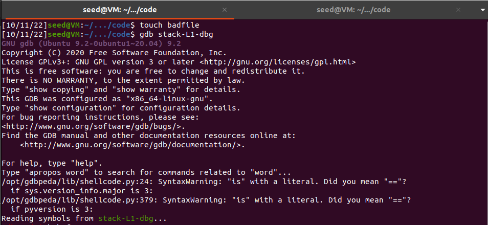
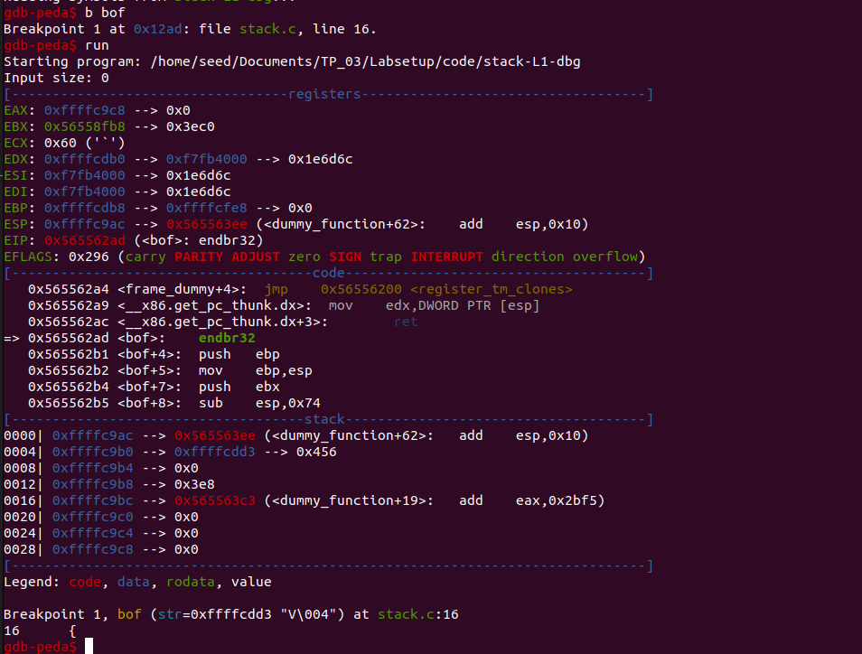
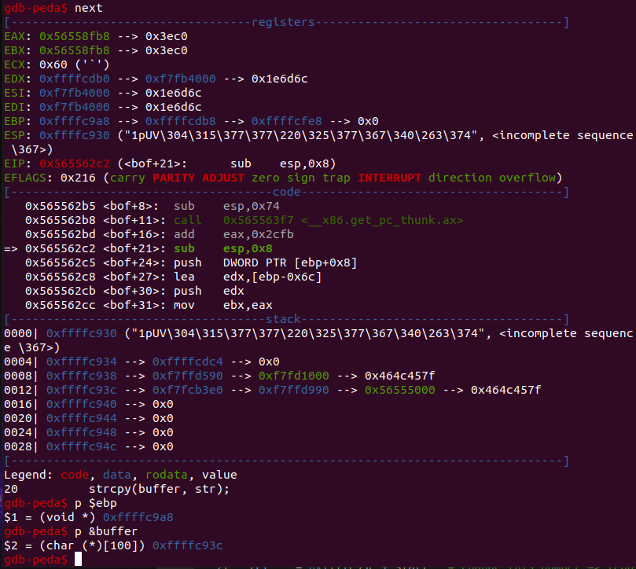
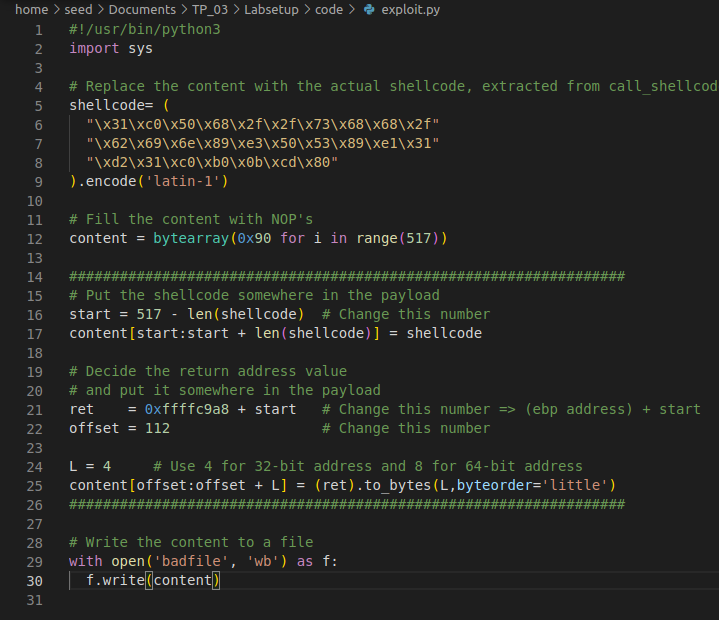
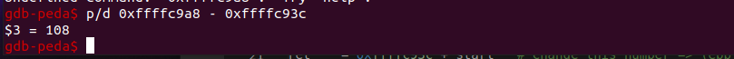

# **LOGBOOK WEEK 5**

# Preparations

- Disable address randomization (no stack and heap addresses randomization), so that the variables addresses can be the same in each program execution
```bash
sudo sysctl -w kernel.randomize_va_space=0
```
- Changed shell linked to /bin/sh, so that the shell executed allows for Set-UID program attacks
```
sudo ln -sf /bin/zsh /bin/sh
```

# Task 1: Getting familiar with Shellcode

- Compile call_shellcode.c using the provided makefile.
- Executing both a32.out and a64.out grants us access to root shell, this is possible because even tho our system is 64 bit, it has compatibility with 32 bit commands.

# Task 2: Understanding the Vulnerable Program

- Since all preparations (first segment of this logbook) were already done, 
- For the next task, we needed stack-L1, so we checked that it had a buffer of 517 bytes.

# Task 3: Launching Attack on 32-bit Program (Level 1)

- First, we need to create a file to gather information about stack-L1, named badfile.
- Then we open the debug mode for stack-L1 (stack-L1-dbg) file in gdb to gather the information we needed.

```bash
touch badfile
gdb stack-L1-dbg
```

  

```bash
b bof
run
```
  

```bash
next 
p $ebp    # address for ebp
p &buffer # address of the start of buffer
```
  

- With this information gathered, we are not able to create our badfile with the help of the provided file **exploit.py**, by changing the lines that were flagged with comments for change:



- Resume of things changed:
  - **start:** we changed this information to 517 - len(shellcode), since we have a buffer of 517 bytes and we want to execute shellcode that was 27 bytes, meaning `517 - 27 = 490`.
  - **ret:** since we know that the buffer starts at `0xffffc93c` and that it's size is 517 bytes, we want to put our shellcode 27 bytes before the end, hence the return address of `0xffffc93c + 490`.
  - **offset:** changed the offset value to 112, which is the distance between the start of the buffer and return address plus the size of the ebp `(108 + 4 = 112)` which we want to rewrite, this was calculated using: 

  

## Running the exploit:
- We execute exploit.py to create the badfile needed to the exploit and then we run stack-L1, which grants us access to the root shell, where we can execute very dangerous commands like this one:


Running this command, we completely broke our OS, rendering it completely useless, so we had to revert it using a previous snapshot after it crashed.
This shows one of the dangers of Buffer Overflow attacks, the ability to execute malicious commands in the shell.

<br>

# Group 7, 03/10/2022
 
* Afonso Jorge Farroco Martins, up202005900@fe.up.pt
* Eduardo Filipe Leite da Silva, up202005283@fe.up.pt
* José Diogo Pinto, up202003529@fe.up.pt


