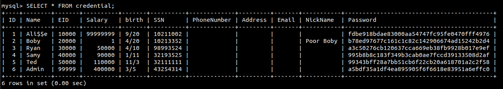

# Starting
Change the file /etc/hosts using the following command:
```bash
sudo gedit /etc/hosts
# change the line corresponding to SQL Injection lab to the following
# 10.9.0.5 www.seed-server.com
```

# Lab Tasks

## 3.1 Get Familiar with SQL Statements
1. Open a new terminal
1. dcbuild
2. dcup

  

4. Num novo terminal:
   
  

  

## 3.2 SQL Injection Attack on SELECT Statement

### Task 3.2.1: Attack from the webpage

```php
meter cópia do código do unsafe.php
```

We can explore a vulnerability in the php query to login as adminstrator into the page:

  

After clicking login with the input above in the username, we get into the admin page, containing all the user details:

  

This is possible since the single-quote is not escaped, allowing us to inject a SQL query into the php code. The ' terminates the input string, and the # is used to comment out everything after the username.

### Task 3.2.2: Attack from the CLI

We use the following curl command to forge a HTTP request to the server and perform a login from the command-line: 
```bash
curl www.seed-server.com/unsafe_home.php?username=admin%27%23&Password=
# %27 is the url encoding for ' and %23 for #
```
#### Result

As we can see, we get the same result as in the previous task, with the admin page being displayed in it's HTML format.

  

# Task 3.2.3: Append a new SQL statement. 

We tried using the following command on the username part of the login page:
```sql
Admin';Select * FROM credential;#
```

 

This is not allowed since the code in unsafe_home.php used for authentication utilizes the query() from the php API, that only allows a single query. To be able to use several queries within the same function call, we can use for multiquery().

# 3.3

## Task 3.3.1: Modify your own salary

### Insert code snippet here ### 
```php
```

Since we have acess to the tables in the sql server, we have access to Alice information and we know that her password in the DB is stored as 'fdbe918bdae83000aa54747fc95fe0470fff4976'.
Analysing the php code for login, we know that the encryption algorithm used was SHA-1, and since her password was really simple, we can use a tool like hashcat to crack it and obtain her 'real' password 'seedalice'.

  

Inside the Edit Profile Page, we input into for example the NickName field the following code:
```sql
', Salary = '99999999', Name = 'Ali$$e' WHERE Eid = '10000'#
```
  

And as a result, we managed to update the table **credential**: 
  

 

## Task 3.3.2: Modify other people’ salary. 

Using a similar approach, we can in a simillar inside Edit Profile Page, we input into for example the NickName field the following code:
```sql
', Salary = '1', NickName = 'Poor Boby' WHERE Eid = '20000'#
```

  

# Task 3.3.3: Modify other people’ password.

We chosen '1234' as the new password for the boss Boby, and after analysing the code, we know that the password will never be encrypted before being inserted to the DB, so we need to convert it already to it's encrypted version using SHA-1, and then insert it into the DB. (result = 7110eda4d09e062aa5e4a390b0a572ac0d2c0220).

Similarly to 3.1 and 3.2, we can use the following code to update the table **credential**.
```sql
', Password = '7110eda4d09e062aa5e4a390b0a572ac0d2c0220' WHERE Eid = '20000'#
```

Now, the new password for boby is officialy '1234' and we can login into the account using it.

  

# Group 7, 06/11/2022
 
* Afonso Jorge Farroco Martins, up202005900@fe.up.pt
* Eduardo Filipe Leite da Silva, up202005283@fe.up.pt
* José Diogo Pinto, up202003529@fe.up.pt

