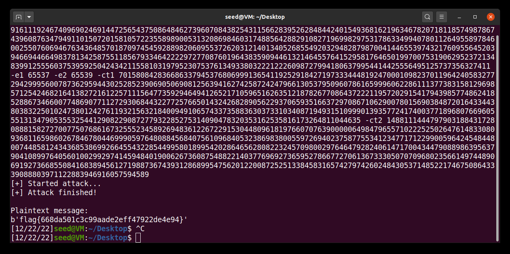

# CTF Weeks 12-13

## Submitted Flags

- Challenge 1: flag{b06ffff8373413681100300a27c82cdd}
- Challenge 2: flag{668da501c3c99aade2eff47922de4e94}

## Task 1 

As we are told in the CTF's information, the prime numbers p and q are close to 2^512 and 2^513, respectively. Taking that into account, one of the first things that come to mind, is to experiment with the next prime of each of those numbers. To do that, we modified the provided python script to include __sympy__ so we could use the __nextprime__ function. With the prime numbers in hand, we can calculate the private exponent d, and then the flag. To calculate d, we first calculate the totient of n with (p-1)*(q-1). Then, we __calculate d by finding the modular inverse of e modulo totient__.

Having all that data, we can connect to the server and receive the flag using:

```bash
nc ctf-fsi.fe.up.pt 6000
```

from where we receive the following encrypted message:

00000000000000000000000000000000000000000000000000000000000000000000000000000000000000000000000000000000000000000000000000000000000000000000000000000000000000000000000000000000000000000000000000000000000000000000000000000000000000000000000000000000000000004ae999899ab65bf02319d116549c515806726056d78da4462230b289ccf7a72613597348f958ef188bdcf7eaed1203d9bfde2f6ba4d01e03021dc43afdb2d92399b0f2a6713f30b483e9bef5b5e84557ea0b15e23df283f88bb8c10b553976006dc62c3e8dbb90eb69884c9b02241f960e86cb5359b281a7956fbaabb746d041

The final step is to pass that message to the python script, which does the decryption, and receive the flag. The final script is the following:

```python
from binascii import hexlify, unhexlify
from sympy import *

p = nextprime(2**512) 
q = nextprime(2**513) 
n = p*q
totient = (p-1)*(q-1)  
e = 0x10001 # a constant
#d = # a number such that d*e % ((p-1)*(q-1)) = 1
d = pow(e, -1, totient)

enc_flag = "00000000000000000000000000000000000000000000000000000000000000000000000000000000000000000000000000000000000000000000000000000000000000000000000000000000000000000000000000000000000000000000000000000000000000000000000000000000000000000000000000000000000000004ae999899ab65bf02319d116549c515806726056d78da4462230b289ccf7a72613597348f958ef188bdcf7eaed1203d9bfde2f6ba4d01e03021dc43afdb2d92399b0f2a6713f30b483e9bef5b5e84557ea0b15e23df283f88bb8c10b553976006dc62c3e8dbb90eb69884c9b02241f960e86cb5359b281a7956fbaabb746d041"

def enc(x):
	int_x = int.from_bytes(x, "big")
	y = pow(int_x,e,n)
	return hexlify(y.to_bytes(256, 'big'))

def dec(y):
	int_y = int.from_bytes(unhexlify(y), "big")
	x = pow(int_y,d,n)
	return x.to_bytes(256, 'big')

y = dec(enc_flag)
print(y.decode())
```

The flag returned by the script for this task is __flag{b06ffff8373413681100300a27c82cdd}__.

## Task 2

After reading the information regarding the CTF and doing some research, we came across a type of attack to the RSA encryption algorithm called __"Common Modulus"__. As the name suggests, this attack is based on the fact that the modulus of the two messages is the same, being the only difference the public exponent. According to Bezouts theorem, the greatest common divisor of two numbers is the product of their greatest common divisor and the least common multiple. In this case, the greatest common divisor is 1, and the least common multiple is the modulus n. This means that we can find the private exponent d by calculating the modular inverse of e modulo the least common multiple of the two public exponents.

The website that we used to gather this information also provided a python script that does exactly the process described above, effectivelt exploiting the "vulnerability" that the CTF presents. The script, which we adapted to our needs, is the following:

After connection to the server using netcat, and getting the information, we run the script with arguments -modulus -e1 -e2 -message1(converted from hex to decimal) -message2(converted from hex to decimal):

```bash	
python3 common_mod.py -n 29802384007335836114060790946940172263849688074203847205679161119246740969024691447256543750864846273960708438254311566283952628484424015493681621963467820718118574987867439608763479491101507201581057223558989005313208698460317488564288291082719699829753178633499407801126495589784600255076069467634364857018709745459288982060955372620312140134052685549203294828798700414465539743217609556452039466944664983781342587551185679334642222972770876019643835909446132146455764152958176465019970075319062952372134839912555603753959250424342115581031979523075376134933803222122260987279941806379954414425556495125737356327411 -e1 65537 -e2 65539 -ct1 7015808428366863379453768069991365411925291842719733344481924700010982370119642405832772942999560078736295944302528523906905069081256394162742587242479661305379509607861659996062286111377383158129698571254246821641382721612257111564773592946494126521710596516263512187826770864372221195720291541794398577486241852886734660077486907711272930684432277257665014324268289056229370659351663729708671062900780156903848720164334438038322501024738012427611932156321840094910657433735883630373310340871949315109990139357724174003771896807669605551313479053553254412908229087277932285275314090478320353162535816173264811044635 -ct2 14881114447979031884317280888158272700775076861673255523458926948361226722915304480961819766070763900000649847965571022252502647614833080936811659860267846780446999059764808845684075610968405323869838005597269402375877553412347717122990059642454844800744858124343685386992664554322854499580189954202864656280822324570980029764647928240614717004344790889863956379041089976405601002992974145948401900626736087548822140377696927365952786677270613673330507070968023566149744890691927366855084168389456127198873674393128689954756201220087252513384583165742797426024843053714852217467508643339088803971122883946916057594589
```
And we get the following result:

  

From which we get our flag __flag{668da501c3c99aade2eff47922de4e94}__

# Group 7, 23/12/2022
 
* Afonso Jorge Farroco Martins, up202005900@fe.up.pt
* Eduardo Filipe Leite da Silva, up202005283@fe.up.pt
* José Diogo Pinto, up202003529@fe.up.pt