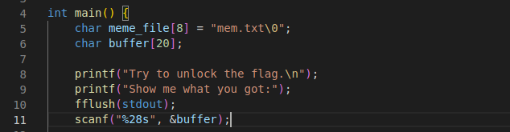
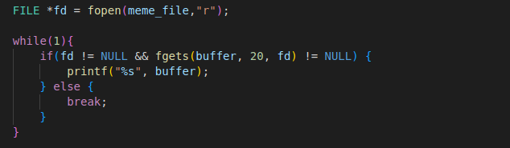
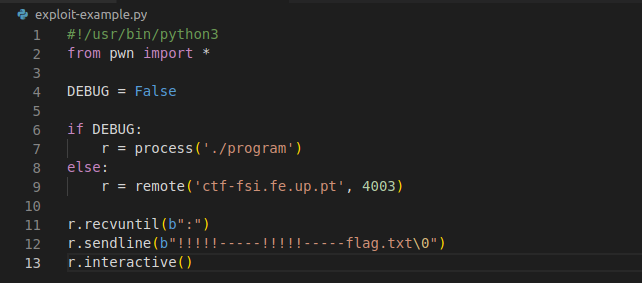
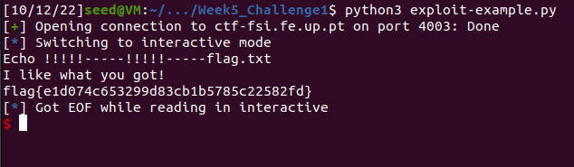
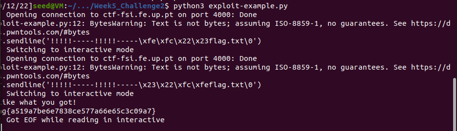

# **CTF Challenges for Week 5**

# Challenge 1

By analysing the source code within main.c from the foulder provided for this challenge, we can see that there is a difference between the size of the read from __scanf__ function (28 bytes, line 11) and the memory allocated for the __buffer__ (20 bytes, line 6).

  


The variable meme_file controls a file read from memory. Since we already have the information that the flag is stored in a file named flag.txt, all we have to do is find a way to manipulate the variable meme_file to value "flag.txt", so then the program runs, it will dump that file.

Without any of the counter-mesures enabled, when there are 8 extra bytes overflowed, the variable __meme_file__ is overwritten with malicious payload (fopen() is taking meme_file as an argument).

  

This manipulation needs to fit in the extra 8 bytes that scanf() is reading, but since "flag.txt" has exactly 8 bytes, there should be no problem.
We inject exactly 20 bytes of trash to fill the __buffer__ and inject "flag.txt" right at the end to overwrite the meme_file variable.

  

And thus, after executing the code from the image above, we are prompted with our __flag__.

  

# Challenge 2

This challenge is similar to the first one, since there is also a buffer overflow vulnerability that can be exploited to overwrite the content of local variables.

This time the difference of size is of 12 bytes, which allows to overwrite both val and meme-file.

There is an extra layer of protection in this challenge, an key input that needs to be matched to access the functionality of file dumping.

The key, as inspected in main.c is equal to __0xfefc2223__.

The trick here is that we cannot simply append the key to our __r.sendline()__ command in it's normal format like this: 

```python
r.sendline('!!!!!-----!!!!!-----\xfe\xfc\x22\x23flag.txt\0') # key = 0xfefc2223
```

After some time, trying the above code without success, we noticed that the architecture of the program is described as __i386-32-little__, meaning it's using **little-endian**, meaning that the least significant byte (the "little end") of the data is placed at the byte with the lowest address.

With this information, we changed the our exploit-example.py file to:

```python
r.sendline('!!!!!-----!!!!!-----\x23\x22\xfc\xfeflag.txt\0')     
```

And now, after executing the .py file, we get our flag.

  

<br>

# Group 7, 03/10/2022
 
* Afonso Jorge Farroco Martins, up202005900@fe.up.pt
* Eduardo Filipe Leite da Silva, up202005283@fe.up.pt
* José Diogo Pinto, up202003529@fe.up.pt